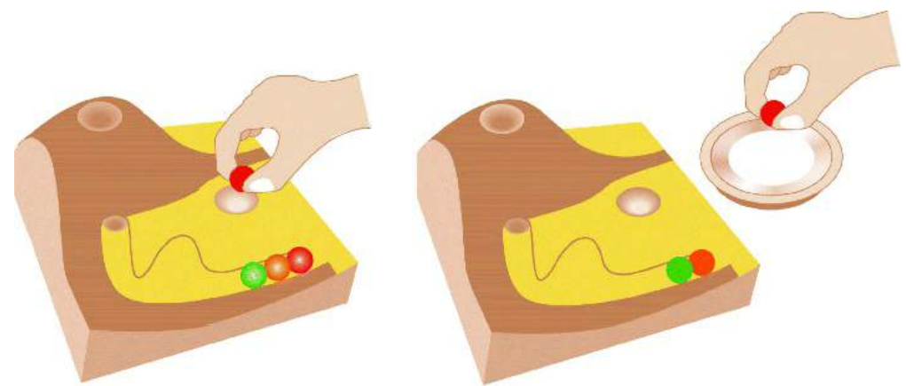

# **Chapter 1**
# _Bagian 1_

# **What is Interaction Design?**
# Apa itu Desain Interaksi?

1.1 Introduction _(Pengenalan)_
1.2 Good and Poor Design _(Desain Baik dan Buruk)_
1.3 What Is Interaction Design? _(Apa itu Desain Interaksi?)_
1.4 The User Experience _(Pengalaman Pengguna)_
1.5 The Process of Interaction Design _(Proses Desain Interaksi)_
1.6 Interaction Design and the User Experience _(Desain Interaksi dan Pengalaman Pengguna)_

># Objectives
>The main aims of this chapter are to:
> - Explain the difference between good and poor interaction design
> - Describe what interaction design is and how it relates to human–computer interaction and other fields.
> - Explain the relationship between the user experience and usability.
> - Describe what and who is involved in the process of interaction design.
> - Outline the different forms of guidance used in interaction design.
> - Enable you to evaluate an interactive product and explain what is good and bad about it in terms of the goals and core
principles of interaction design.

> # _Tujuan_
> - _Tujuan utama dari bab ini adalah untuk:_
> - _Jelaskan perbedaan antara desain interaksi yang baik dan buruk._
> - _Jelaskan apa itu desain interaksi dan bagaimana kaitannya dengan interaksi manusia-komputer dan bidang lainnya._
> - _Jelaskan hubungan antara pengalaman pengguna dan kegunaan._
> - _Jelaskan apa dan siapa yang terlibat dalam proses desain interaksi_
> - _Outline the different forms of guidance used in interaction design._
> - _Memungkinkan Anda untuk mengevaluasi produk interaktif dan menjelaskan apa yang baik dan buruk tentang itu dalam hal tujuan dan inti
prinsip desain interaksi._

# 1.1 Introduction (Pengenalan)

How many interactive products are there in everyday use? Think for a minute about what you use in a typical day: smartphone, tablet computer, remote control, coffee machine, ATM, ticket machine, printer, iPod, GPS, e-reader, TV, electric toothbrush, radio, games
console . . . the list is endless. Now think for a minute about how usable they are. How many are actually easy, effortless, and enjoyable
to use? Some, like the iPod, are a joy to use. Others, like a ticket machine, can be very frustrating. Why is there a difference?

_Berapa banyak produk interaktif yang ada dalam penggunaan sehari-hari? Pikirkan sejenak tentang apa yang Anda gunakan pada hari-hari biasa: smartphone, komputer tablet, remote control, mesin kopi, ATM, mesin tiket, printer, iPod, GPS, e-reader, TV, sikat gigi elektrik, radio, game
konsol. . . daftarnya tidak ada habisnya. Sekarang pikirkan sejenak tentang seberapa berguna mereka. Berapa banyak yang sebenarnya mudah, mudah, dan menyenangkan
menggunakan? Beberapa, seperti iPod, menyenangkan untuk digunakan. Lainnya, seperti mesin tiket, bisa sangat membuat frustrasi. Mengapa ada perbedaan?_

Many products that require users to interact with them, such as smartphones and social networking sites, have been designed
primarily with the user in mind. They are generally easy and enjoyable to use. Others, such as switching from viewing a rented movie
on your smart TVto watching a sports channel, or setting the alarm on a digital clock, have not necessarily been designed with the
users in mind, but have been engineered primarily as systems to perform set functions. While they may work effectively, it can be at the
expense of how they will be used by real people.

_Banyak produk yang mengharuskan pengguna untuk berinteraksi dengan mereka, seperti smartphone dan situs jejaring sosial, telah dirancang
terutama dengan pengguna dalam pikiran. Mereka umumnya mudah dan menyenangkan untuk digunakan. Lainnya, seperti beralih dari menonton film sewaan
di smart TV Anda untuk menonton saluran olahraga, atau menyetel alarm pada jam digital, belum tentu dirancang dengan
pengguna dalam pikiran, tetapi telah direkayasa terutama sebagai sistem untuk melakukan fungsi yang ditetapkan. Meskipun mereka mungkin bekerja secara efektif, itu bisa di
mengorbankan bagaimana mereka akan digunakan oleh orang-orang nyata._

One main aim of interaction design is to reduce the negative aspects (e.g. frustration, annoyance) of the user experience while
enhancing the positive ones (e.g. enjoyment, engagement). In essence, it is about developing interactive products that are easy, effective, and pleasurable to use – from the users’ perspective. In this chapter we begin by examining what interaction design is. We look at the difference between good and poor design, highlighting how products can differ radically in how usable and enjoyable they are. We then describe what and who is involved in the process of interaction design. The user experience, which is a central concern of interaction design, is then introduced. Finally, we outline how to characterize the user experience in terms of usability goals, user
experience goals, and design principles. An assignment is presented at the end of the chapter in which you have the opportunity to put into practice what you have read by evaluating the design of an interactive product.

_Salah satu tujuan utama dari desain interaksi adalah untuk mengurangi aspek negatif (misalnya frustrasi, gangguan) dari pengalaman pengguna saat
meningkatkan yang positif (misalnya kenikmatan, keterlibatan). Intinya, ini tentang mengembangkan produk interaktif
yang mudah, efektif, dan menyenangkan untuk digunakan – dari sudut pandang pengguna. Dalam bab ini kita mulai dengan memeriksa apa itu desain interaksi. Kita lihat perbedaan antara desain yang baik dan buruk, soroti bagaimana produk dapat berbeda secara radikal dalam hal kegunaan dan kesenangannya
adalah. Kami kemudian menggambarkan apa dan siapa yang terlibat dalam proses desain interaksi. Pengalaman pengguna, yang menjadi perhatian utama
desain interaksi, kemudian diperkenalkan. Akhirnya, kami menguraikan bagaimana mengkarakterisasi pengalaman pengguna dalam hal tujuan kegunaan, pengguna
tujuan pengalaman, dan prinsip desain. Sebuah tugas disajikan di akhir bab di mana Anda memiliki kesempatan untuk menempatkan
mempraktekkan apa yang telah Anda baca dengan mengevaluasi desain produk interaktif._

# 1.2 Good and Poor Design _(Desain Baik dan Buruk)_

Acentral concern of interaction design is to develop interactive products that are usable. By this is generally meant easy to learn,
effective to use, and providing an enjoyable user experience. Agood place to start thinking about how to design usable interactive
products is to compare examples of well- and poorly-designed ones. Through identifying the specific weaknesses and strengths of
different interactive products, we can begin to understand what it means for something to be usable or not. Here, we describe two
examples of poorly designed products – a voice mail system used in hotels and the ubiquitous remote control device – and contrast
these with two well-designed examples of products that perform the same function.

_Perhatian utama dari desain interaksi adalah untuk mengembangkan produk interaktif yang dapat digunakan. Dengan ini umumnya dimaksudkan mudah dipelajari,
efektif untuk digunakan, dan memberikan pengalaman pengguna yang menyenangkan. Tempat yang baik untuk mulai berpikir tentang bagaimana mendesain interaktif yang dapat digunakan
produk adalah untuk membandingkan contoh yang dirancang dengan baik dan yang buruk. Dengan mengidentifikasi kelemahan dan kekuatan spesifik dari
produk interaktif yang berbeda, kita dapat mulai memahami apa artinya sesuatu dapat digunakan atau tidak. Di sini, kami menggambarkan dua
contoh produk yang dirancang dengan buruk – sistem pesan suara yang digunakan di hotel dan perangkat remote control yang ada di mana-mana – dan kontras
ini dengan dua contoh produk yang dirancang dengan baik yang melakukan fungsi yang sama._

# _(1) Voice Mail System_ (Sistem Pesan Suara)

Imagine the following scenario. You are staying at a hotel for a week while on a business trip. You discover you have left your cell phone
at home so you have to rely on the hotel's facilities. The hotel has a voice mail system for each room. To find out if you have a message,
you pick up the handset and listen to the tone. If it goes ‘beep, beep, beep’ there is a message. To find out how to access the message
you have to read a set of instructions next to the phone. You read and follow the first step:

_Bayangkan skenario berikut. Anda tinggal di hotel selama seminggu saat dalam perjalanan bisnis. Anda menemukan Anda telah meninggalkan ponsel Anda
di rumah jadi harus mengandalkan fasilitas hotel. Hotel ini memiliki sistem pesan suara untuk setiap kamar. Untuk mengetahui apakah Anda memiliki pesan,
Anda mengangkat gagang telepon dan mendengarkan nadanya. Jika berbunyi 'bip, bip, bip' ada pesan. Untuk mengetahui cara mengakses pesan
Anda harus membaca satu set instruksi di sebelah telepon. Anda membaca dan mengikuti langkah pertama:_

> ‘1. Touch 41.’ _(‘1. Sentuh 41.’)_
> The system responds: ‘You have reached the Sunny Hotel voice message center. Please enter the room number for which you would like to leave a message.’
> _Sistem menjawab: 'Anda telah mencapai pusat pesan suara Sunny Hotel. Silakan masukkan nomor kamar yang Anda inginkan
ingin meninggalkan pesan.'_
> You wait to hear how to listen to a recorded message. But there are no further instructions from the phone. You look down at the
instruction sheet again and read:
> _Anda menunggu untuk mendengar cara mendengarkan pesan yang direkam. Namun tidak ada instruksi lebih lanjut dari ponsel tersebut. Anda melihat ke bawah
lembar instruksi lagi dan baca:_
> ‘2. Touch*, your room number, and #.’ _(‘2. Sentuh*, nomor kamar Anda, dan #.’)_
> You do so and the system replies: ‘You have reached the mailbox for room 106. To leave a message, type in your password.’
> _Anda melakukannya dan sistem membalas: 'Anda telah mencapai kotak surat untuk kamar 106. Untuk meninggalkan pesan, ketikkan kata sandi Anda.'_
> You type in the room number again and the system replies: ‘Please enter room number again and then your password.’
> _Anda mengetikkan nomor kamar lagi dan sistem menjawab: 'Silakan masukkan nomor kamar lagi dan kemudian kata sandi Anda.'_

You don't know what your password is. You thought it was the same as your room number, but clearly it's not. At this point you give up and call reception for help. The person at the desk explains the correct procedure for recording and listening to messages. This involves typing in, at the appropriate times, the room number and the extension number of the phone (the latter is the password, which
is different from the room number). Moreover, it takes six steps to access a message and five steps to leave a message. You go out and buy a new cell phone.

_Anda tidak tahu apa kata sandi Anda. Anda mengira itu sama dengan nomor kamar Anda, tapi ternyata tidak. Pada titik ini Anda menyerah dan menelepon resepsionis untuk meminta bantuan. Orang di meja menjelaskan prosedur yang benar untuk merekam dan mendengarkan pesan. Ini melibatkan mengetik, pada waktu yang tepat, nomor kamar dan nomor ekstensi telepon (yang terakhir adalah kata sandi, yang berbeda dari nomor kamar). Selain itu, dibutuhkan enam langkah untuk mengakses pesan dan lima langkah untuk meninggalkan pesan. Kamu keluar
dan membeli ponsel baru._

What is problematic with this voice mail system?

_Apa yang bermasalah dengan sistem pesan suara ini?_

> - It is infuriating.
> - It is confusing.
> - It is inefficient, requiring you to carry out a number of steps for basic tasks.
> - It is difficult to use.
It has no means of letting you know at a glance whether any messages have been left or how many there are. You have to pick up
the handset to find out and then go through a series of steps to listen to them.
It is not obvious what to do: the instructions are provided partially by the system and partially by a card beside the phone.

> - _Ini menyebalkan._
> - _Ini membingungkan._
> - _Ini tidak efisien, mengharuskan Anda melakukan sejumlah langkah untuk tugas-tugas dasar._
> - _Sulit digunakan._
> - _Tidak ada cara untuk memberi tahu Anda secara sekilas apakah ada pesan yang tertinggal atau ada berapa banyak. Anda harus mengambil
handset untuk mencari tahu dan kemudian melalui serangkaian langkah untuk mendengarkannya._
> - _Tidak jelas apa yang harus dilakukan: instruksi diberikan sebagian oleh sistem dan sebagian oleh kartu di samping telepon._

Now consider the following phone answering machine. Figure 1.1 shows two small sketches of an answering machine phone.
Incoming messages are represented using physical marbles. The number of marbles that have moved into the pinball-like chute
indicates the number of messages. Dropping one of these marbles into a slot in the machine causes the recorded message to play.
Dropping the same marble into another slot on the phone dials the caller who left the message.

_Sekarang perhatikan mesin penjawab telepon berikut. Gambar 1.1 menunjukkan dua sketsa kecil dari telepon mesin penjawab.
Pesan masuk diwakili menggunakan kelereng fisik. Jumlah kelereng yang telah pindah ke saluran seperti pinball
menunjukkan jumlah pesan. Menjatuhkan salah satu kelereng ini ke dalam slot di mesin menyebabkan pesan yang direkam diputar.
Menjatuhkan kelereng yang sama ke slot lain di telepon memanggil penelepon yang meninggalkan pesan._

Figure 1.1 The marble answering machine
_Gambar 1.1 Mesin penjawab marmer_
Source: Adapted from Gillian Crampton Smith: “The Hand that Rocks the Cradle” ID Magazine, May/June 1995, pp. 60–65.

How does the marble answering machine differ from the voice mail system?

_Bagaimana mesin penjawab marmer berbeda dari sistem pesan suara?_

> - It uses familiar physical objects that indicate visually at a glance how many messages have been left.
> - It is aesthetically pleasing and enjoyable to use.
> - It only requires one-step actions to perform core tasks.
> - It is a simple but elegant design.
> - It offers less functionality and allows anyone to listen to any of the messages.

> - _Ini menggunakan objek fisik yang sudah dikenal yang menunjukkan secara visual berapa banyak pesan yang tersisa._
>- _Hal ini estetis menyenangkan dan menyenangkan untuk digunakan._
> - _Ini hanya membutuhkan tindakan satu langkah untuk melakukan tugas inti._
> - _Ini adalah desain yang sederhana namun elegan._
> - _Ini menawarkan fungsionalitas yang lebih sedikit dan memungkinkan siapa pun untuk mendengarkan pesan apa pun._

The marble answering machine is considered a design classic and was designed by Durrell Bishop while he was a student at the Royal College of Art in London (described by Crampton Smith, 1995). One of his goals was to design a messaging system that represented its basic functionality in terms of the behavior of everyday objects. To do this, he capitalized on people's everyday knowledge of how the physical world works. In particular, he made use of the ubiquitous everyday action of picking up a physical object and putting it down in another place. This is an example of an interactive product designed with the users in mind. The focus is on providing them with an enjoyable experience but one that also makes efficient the activity of receiving messages. However, it is
important to note that although the marble answering machine is a very elegant and usable design, it would not be practical in a hotel setting. One of the main reasons is that it is not robust enough to be used in public places: for instance, the marbles could easily get lost or be taken as souvenirs. Also, the need to identify the user before allowing the messages to be played is essential in a hotel
setting. When considering the design of an interactive product, therefore, it is important to take into account where it is going to be used and who is going to use it. The marble answering machine would be more suited in a home setting – provided there were no children who might be tempted to play with the marbles!

_Mesin penjawab marmer dianggap sebagai desain klasik dan dirancang oleh Durrell Bishop saat dia menjadi mahasiswa di
Royal College of Art di London (dijelaskan oleh Crampton Smith, 1995). Salah satu tujuannya adalah merancang sistem pesan yang mewakili fungsionalitas dasarnya dalam hal perilaku objek sehari-hari. Untuk melakukan ini, dia memanfaatkan keseharian orang pengetahuan tentang bagaimana dunia fisik bekerja. Secara khusus, dia memanfaatkan tindakan sehari-hari yang ada di mana-mana untuk mengambil objek fisik dan meletakkannya di tempat lain. Ini adalah contoh produk interaktif yang dirancang dengan mempertimbangkan pengguna. Fokusnya ada di memberi mereka pengalaman yang menyenangkan tetapi juga mengefisienkan aktivitas menerima pesan. Namun, itu adalah penting untuk dicatat bahwa meskipun mesin penjawab marmer adalah desain yang sangat elegan dan dapat digunakan, itu tidak akan praktis di hotel pengaturan. Salah satu alasan utamanya adalah karena tidak cukup kuat untuk digunakan di tempat umum: misalnya, kelereng dapat dengan mudah didapat. hilang atau diambil sebagai oleh-oleh. Juga, kebutuhan untuk mengidentifikasi pengguna sebelum mengizinkan pesan untuk diputar sangat penting di hotel pengaturan. Oleh karena itu, ketika mempertimbangkan desain produk interaktif, penting untuk mempertimbangkan di mana produk tersebut akan digunakan dan siapa yang akan menggunakannya. Mesin penjawab marmer akan lebih cocok digunakan di rumah – asalkan tidak ada anak-anak yang mungkin tergoda untuk bermain dengan kelereng!_

> Video of Durrell Bishop's answering machine at http://vimeo.com/19930744
> _Video mesin penjawab Durrell Bishop di http://vimeo.com/19930744_

# (2) Remote Control Device _(Perangkat Kontrol Jarak Jauh)_

Every home entertainment system, be it the TV, cable, smart TV, music system, and so forth, comes with its own remote control device. Each one is different in terms of how it looks and works. Many have been designed with a dizzying array of small, multicolored, and double-labeled buttons (one on the button and one above or below it) that often seem arbitrarily positioned in relation to one another. Many viewers, especially when sitting in their living room, find it difficult to locate the right ones, even for the simplest of tasks, like pausing or finding the main menu. It can be especially frustrating for those who need to put on their reading glasses each time to read the buttons. The remote control device appears to have been put together very much as an afterthought.

_Setiap sistem hiburan rumah, baik itu TV, kabel, smart TV, sistem musik, dan sebagainya, dilengkapi dengan perangkat remote controlnya sendiri.
Masing-masing berbeda dalam hal tampilan dan cara kerjanya. Banyak yang telah dirancang dengan rangkaian kecil, warna-warni, dan
tombol berlabel ganda (satu di tombol dan satu di atas atau di bawahnya) yang sering tampak diposisikan secara sewenang-wenang dalam kaitannya satu sama lain.
Banyak pemirsa, terutama ketika duduk di ruang tamu mereka, merasa sulit untuk menemukan yang tepat, bahkan untuk tugas yang paling sederhana, seperti
menjeda atau menemukan menu utama. Ini bisa sangat membuat frustrasi bagi mereka yang harus memakai kacamata baca setiap kali membaca
tombol. Perangkat remote control tampaknya telah disatukan sebagai renungan._

In contrast, much effort and thought went into the design of the TiVo remote control. The buttons were large, clearly labeled, and logically arranged, making them easy to locate and use in conjunction with the menu interface that appears on the TV monitor. In terms of its physical form, the remote device was designed to fit into the palm of a hand, having a peanut shape. It also has a playful look and feel about it: colorful buttons and cartoon icons were used that are very distinctive, making it easy to identify them in the dark and without having to put reading glasses on.

_Sebaliknya, banyak usaha dan pemikiran masuk ke dalam desain remote control TiVo. Tombolnya besar, diberi label dengan jelas, dan logis diatur, membuatnya mudah ditemukan dan digunakan bersama dengan antarmuka menu yang muncul di monitor TV. Dalam hal nya bentuk fisik, perangkat remote dirancang agar sesuai dengan telapak tangan, memiliki bentuk kacang. Ini juga memiliki tampilan dan nuansa yang menyenangkan tentang itu: tombol warna-warni dan ikon kartun digunakan yang sangat khas, membuatnya mudah untuk mengidentifikasinya dalam gelap dan tanpa harus memakai kacamata baca._

How was it possible to create such a usable and appealing remote device where so many others have failed? The answer is simple: TiVo invested the time and effort to follow a user-centered design process. Specifically, TiVo's director of product design at the time involved potential users in the design process, getting their feedback on everything from the feel of the device in the hand to where best to place the batteries – making them easy to replace but not prone to falling out. He and his design team also resisted the trap of ‘buttonitis’ – to which so many other remote controls have fallen victim – where buttons breed like rabbits, one for every new function. They did this by restricting the number of control buttons embedded in the device to the essential ones. Other functions were then represented as part of the menu options and dialog boxes displayed on the TVscreen, which could be selected via the core set of physical control buttons. The result was a highly usable and pleasing device that has received much praise and numerous design awards.

_Bagaimana mungkin membuat perangkat jarak jauh yang dapat digunakan dan menarik seperti itu di mana begitu banyak perangkat lain yang gagal? Jawabannya sederhana:
TiVo menginvestasikan waktu dan upaya untuk mengikuti proses desain yang berpusat pada pengguna. Secara khusus, direktur desain produk TiVo pada saat itu melibatkan pengguna potensial dalam proses desain, mendapatkan umpan balik mereka tentang segala hal mulai dari nuansa perangkat di tangan hingga tempat terbaik untuk memasang baterai – membuatnya mudah diganti tetapi tidak mudah jatuh. Dia dan tim desainnya juga menolak jebakan 'buttonitis' – yang menjadi korban begitu banyak remote control lainnya – di mana tombol berkembang biak seperti kelinci, satu untuk setiap fungsi baru. Mereka melakukan ini dengan membatasi jumlah tombol kontrol yang tertanam di perangkat hanya yang penting. Fungsi lainnya adalah direpresentasikan sebagai bagian dari opsi menu dan kotak dialog yang ditampilkan di layar TV, yang dapat dipilih melalui rangkaian inti tombol kontrol fisik. Hasilnya adalah perangkat yang sangat berguna dan menyenangkan yang telah menerima banyak pujian dan banyak desain penghargaan._
